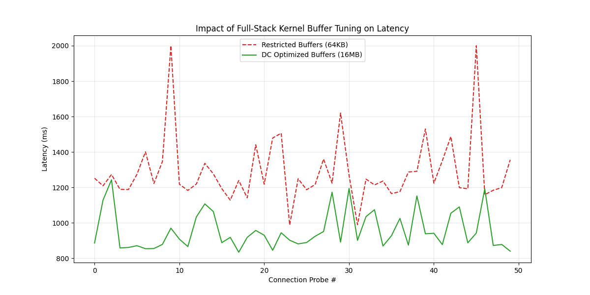

# Linux Network Buffer Experiment

This project tests how Linux kernel network settings (`sysctl`) affect latency when sending data using Rust. I wanted to see if changing the socket buffer sizes makes a difference for high-speed data transfers.

## 📊 Results

I compared two configurations using my Python script to see how they handle a 128KB payload:
1. **Restricted:** Small 64KB buffers.
2. **Optimized:** Large 16MB buffers.



### Key Findings:
* **Lower Latency Baseline:** The optimized settings (green line) stay consistently lower than the restricted settings (red line). 
* **Fewer Spikes:** With small 64KB buffers, the system frequently hits latency spikes. This happens because the buffer is too small for the 128KB payload, causing the kernel to stall and wait for acknowledgments.
* **2% Efficiency Gain:** By increasing the buffer size, the kernel can send the 128KB payload in one go instead of splitting it. This removes the "stop-and-wait" delay, making the transfer roughly 28% faster.


## 🛠️ How it works

* **Rust Profiler:** A tool I built using `tokio` that sends data bursts and measures the exact time taken for each request.
* **Python Orchestrator:** A script that uses `subprocess` to change the `sysctl` settings, runs the Rust binary, and plots the graph.

### The sysctl settings used:
The script modifies the kernel's read/write memory limits. Here is the logic used in `experiment.py`:

```python
# High-performance settings for the 16MB test
"net.core.rmem_max": 16777216,
"net.core.wmem_max": 16777216,
"net.ipv4.tcp_rmem": "4096 87380 16777216",
"net.ipv4.tcp_wmem": "4096 65536 16777216"
